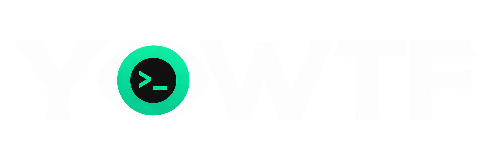

<p align="center">
  
</p>

<p align="center">
  <strong>A local-first, read-only developer workstation and project health diagnostic CLI.</strong><br>
  <em>"Yo, WTF is happening?"</em>
</p>

<p align="center">
  <a href="https://github.com/isthatpratham/yowtf/actions/workflows/ci.yml"></a>
  <a href="https://www.npmjs.com/package/yowtf"></a>
  <a href="https://github.com/isthatpratham/yowtf/blob/main/LICENSE"></a>
  = 20.0.0">
</p>

---

YOWTF inspects your developer machine, environment configuration, runtimes, tooling, ports, processes, dependencies, Git state, and storage pressure — then explains what may be wrong, why it matters, and where to look next.

- **Local-first**: runs entirely on your machine.
- **Read-only**: observes and explains; never alters your files, system, or Git history.
- **Deterministic**: explicit rules produce predictable results without probabilistic guessing or AI.
- **Zero telemetry**: no analytics, no external tracking, no cloud dependencies.
- **Private by default**: inspects configuration metadata; never dumps secret values.

---

## 🧭 Quick Navigation

- [Quick Start](#-quick-start)
- [What YOWTF Does](#-what-yowtf-does)
- [What It Checks](#-what-it-checks)
- [Scoring](#-scoring)
- [Command Reference](#-command-reference)
- [Global Options](#-global-options)
- [Exit Codes](#-exit-codes)
- [Safe by Design](#-safe-by-design)
- [Example Output](#-example-output)
- [Development](#-development)
- [FAQ](#-faq)
- [Project Links](#-project-links)
- [License](#-license)

---

## ⚡ Quick Start

Run YOWTF instantly without global installation:

```bash
npx yowtf
```

Or install globally:

```bash
npm install -g yowtf
# or
pnpm add -g yowtf
```

### Basic Commands

```bash
# Run full workstation and project diagnostic scan
yowtf

# Health-oriented diagnostic scan highlighting issues requiring attention
yowtf doctor

# Calculate and display workstation health score (0–100)
yowtf score

# Deep explanation of detected findings (problem -> evidence -> impact -> next action)
yowtf explain

# Inspect specific categories
yowtf system
yowtf runtimes
yowtf ports
yowtf env
```

---

## 🛠️ What YOWTF Does

YOWTF executes a structured diagnostic pipeline:

```text
DISCOVER ──> COLLECT ──> DETECT ──> EVALUATE ──> SCORE ──> EXPLAIN ──> REPORT
```

1. **Discover**: Resolves the target workspace, identifies active project types, manifests, and platform capabilities.
2. **Collect**: Gathers low-overhead, read-only evidence across workstation and project surfaces.
3. **Detect**: Evaluates collected evidence against explicit, authoritative V1 diagnostic rules.
4. **Evaluate**: Determines finding statuses (`PASS`, `WARN`, `FAIL`, `SKIPPED`, `UNAVAILABLE`, `ERROR`).
5. **Score**: Calculates a deterministic health score from 0 to 100 based on finding severity.
6. **Explain**: Correlates findings with underlying evidence, architectural impact, and concrete remediation hints.
7. **Report**: Formats results for terminal presentation or machine-readable JSON.

### Anatomy of a Diagnostic Finding

Every detected finding provides structured diagnostic context:

```text
Finding
 ├── Rule ID         e.g. runtime.version.mismatch
 ├── Category        e.g. runtimes
 ├── Status          FAIL | WARN | PASS | SKIPPED | UNAVAILABLE | ERROR
 ├── Severity        CRITICAL | HIGH | MEDIUM | LOW | INFO
 ├── Confidence      HIGH | MEDIUM | LOW
 ├── Title           Summary of the identified condition
 ├── Evidence        Specific observations that triggered the rule
 ├── Impact          Why this issue affects development or reliability
 └── Remediation     Actionable next steps to investigate or resolve
```

---

## 🔍 What It Checks

YOWTF features **60 authoritative V1 diagnostic rules** across 15 developer-focused categories:

| Category             | Scope       | Focus Area                                                                       |
| -------------------- | ----------- | -------------------------------------------------------------------------------- |
| **System**           | Workstation | OS architecture, CPU load, memory pressure, and system uptime                    |
| **Disk**             | Workstation | Storage limits, volume capacity, and partition availability                      |
| **Processes**        | Workstation | Resource hogs, zombie processes, and duplicate dev process instances             |
| **Ports**            | Workstation | Port conflicts, duplicate listeners, and unexpected local server exposure        |
| **Network**          | Workstation | Interface availability, DNS configuration, and active proxy settings             |
| **Environment**      | Environment | PATH anomalies, duplicate entries, shell mismatches, and sensitive key names     |
| **Runtimes**         | Environment | Node.js, Python, Java version alignment, unpinned runtimes, and version managers |
| **Tools**            | Environment | Availability and conflict detection for Git, package managers, and Docker        |
| **Paths**            | Environment | PATH-order shadowing, empty entries, and executable resolution conflicts         |
| **Versions**         | Environment | Runtime requirement constraints vs. resolved system binaries                     |
| **Project**          | Project     | Project manifests, workspace root ambiguity, and config consistency              |
| **Dependencies**     | Project     | Lockfile health, package manager alignment, and dependency integrity             |
| **Git**              | Project     | Repository state, detached HEAD, dirty working trees, and divergence             |
| **Configuration**    | Project     | Project config files, lint/build setups, and environment definitions             |
| **Caches & Storage** | Maintenance | Large developer caches (npm, pnpm, yarn, pip, cargo) and build artifacts         |

> **What YOWTF is NOT:** YOWTF is not an antivirus, firewall, full vulnerability scanner, system monitor, background daemon, process manager, or package manager. It is a targeted developer health diagnostic tool.

---

## 📊 Scoring

YOWTF calculates an objective, deterministic health score between **0 and 100**.

- Starts at **100**.
- Applies penalties based on finding severity:

| Severity     | Full Deduction (`FAIL`) | Partial Deduction (`WARN`) |
| ------------ | ----------------------: | -------------------------: |
| **CRITICAL** |                  25 pts |                   12.5 pts |
| **HIGH**     |                  15 pts |                    7.5 pts |
| **MEDIUM**   |                   8 pts |                    4.0 pts |
| **LOW**      |                   3 pts |                    1.5 pts |
| **INFO**     |                   0 pts |                    0.0 pts |

`PASS`, `SKIPPED`, `UNAVAILABLE`, and `ERROR` findings do not deduct points. The score is clamped to the range `0–100`.

### Health Score Bands

| Score Range | Status Band      | Interpretation                                               |
| ----------: | ---------------- | ------------------------------------------------------------ |
|  **90–100** | 🟢 **EXCELLENT** | Workstation and project environment are in optimal condition |
|   **75–89** | 🟡 **GOOD**      | Minor issues or warnings detected; development unaffected    |
|   **60–74** | 🟠 **FAIR**      | Several warnings or moderate issues require attention        |
|   **40–59** | 🔴 **POOR**      | Significant environmental conflicts or failures present      |
|    **0–39** | 🚨 **CRITICAL**  | Severe issues detected; build or runtime failures likely     |

_Note: The health score is a diagnostic metric for evaluated scope, not a security certification._

---

## 🧰 Command Reference

YOWTF provides 20 canonical public commands:

| Command           | Category    | Purpose                                                                              |
| ----------------- | ----------- | ------------------------------------------------------------------------------------ |
| `yowtf`           | Core        | Full workstation and project diagnostic scan                                         |
| `yowtf doctor`    | Core        | Health-oriented diagnostic scan highlighting prioritized issues                      |
| `yowtf score`     | Core        | Calculate and display the 0–100 workstation/project health score                     |
| `yowtf explain`   | Core        | Deep explanation view (problem → evidence → impact → remediation)                    |
| `yowtf system`    | Workstation | Inspect OS, CPU architecture, memory pressure, and system uptime                     |
| `yowtf disk`      | Workstation | Inspect disk space, storage pressure, and volume limits                              |
| `yowtf processes` | Workstation | Detect process resource hogs and duplicate dev processes (read-only)                 |
| `yowtf ports`     | Workstation | Detect development port conflicts and listening sockets (read-only)                  |
| `yowtf network`   | Workstation | Inspect network interfaces, DNS configuration, and proxy settings                    |
| `yowtf env`       | Environment | Inspect environment variables, PATH entries, and configuration metadata              |
| `yowtf runtimes`  | Environment | Inspect installed and active runtimes (Node.js, Python, Java, etc.)                  |
| `yowtf tools`     | Environment | Inspect developer tools (Git, package managers, Docker, etc.)                        |
| `yowtf paths`     | Environment | Detect PATH-order shadowing, empty entries, and executable conflicts                 |
| `yowtf versions`  | Environment | Diagnose version conflicts and requirement mismatches                                |
| `yowtf project`   | Project     | Diagnose project type, manifest health, and configuration                            |
| `yowtf deps`      | Project     | Diagnose project dependency health, lockfiles, and package manager consistency       |
| `yowtf git`       | Project     | Inspect Git repository health, branch status, and working tree (read-only)           |
| `yowtf config`    | Project     | Inspect project configuration files and environment definitions                      |
| `yowtf caches`    | Maintenance | Identify developer caches and large storage consumers (read-only)                    |
| `yowtf clean`     | Maintenance | Diagnostic cleanup candidate finder; `--preview` reports candidates without deleting |

> **Safety Notice on `clean`:** `yowtf clean` is strictly diagnostic. It reports identified cleanup candidates and estimated space reclamation. It **never deletes files or caches**.

---

## 🎛️ Global Options

The following global options are supported across all commands:

| Option          | Purpose        | Description                                                                 |
| --------------- | -------------- | --------------------------------------------------------------------------- |
| `-h, --help`    | Help           | Display usage information for YOWTF or a specific subcommand                |
| `-V, --version` | Version        | Display the current YOWTF version number                                    |
| `--verbose`     | Verbosity      | Enable detailed diagnostic output including rule IDs and evidence keys      |
| `--no-color`    | Formatting     | Disable ANSI terminal colors for plain-text logs and pipelines              |
| `--json`        | Machine Output | Output pure machine-readable JSON (suppresses animations and banners)       |
| `--quiet`       | Quiet Mode     | Show minimal summaries and essential failures only (suppresses animation)   |
| `--path <dir>`  | Project Path   | Target a specific project directory (applies to project-scoped diagnostics) |

---

## 🚦 Exit Codes

YOWTF adheres to strict, standard CLI exit codes:

| Code  | Status                | Meaning                                                                                                                     |
| :---: | --------------------- | --------------------------------------------------------------------------------------------------------------------------- |
| **0** | **Success**           | The command completed successfully. Finding statuses (`FAIL`, `WARN`, `PASS`) are valid diagnostic outputs and exit code 0. |
| **1** | **Application Error** | Internal runtime error or fatal failure preventing diagnostic completion.                                                   |
| **2** | **Usage Error**       | Unknown command, unrecognized option, missing required argument, or inaccessible project path.                              |

---

## 🛡️ Safe by Design

- **Read-Only**: YOWTF observes and inspects. It never installs packages, uninstalls tools, terminates processes, alters environment files, or mutates Git state.
- **No Automatic Fixes**: YOWTF explains root causes and remediation paths; you decide what changes to make.
- **Zero Telemetry**: No tracking, analytics, crash reporting, or external API calls during standard scans.
- **No Network Requirement**: Diagnostic scans evaluate local workstation state; no internet connection is required.
- **Secrets Protection**: Environment analysis inspects variable names and metadata, never printing credential values.
- **Cross-Platform**: Tailored adapters for Windows, macOS, and Linux with graceful degradation when a metric is unavailable.

---

## 💻 Example Output

When running in an interactive terminal, YOWTF initializes with a fast boot sequence:

```text
YOWTF // INITIALIZING

> loading diagnostic engine...
> preparing collectors...
> preparing detection rules...
> preparing reporting pipeline...
> ready.

Yo, WTF is happening?

┌─────────────────────────────────────────────────────────────┐
│                                                             │
│   Workstation Health Score: 85/100 (GOOD)                   │
│   Total Deductions: 15 pts across 1 finding(s)               │
│   Scope: workstation + project                              │
│                                                             │
└─────────────────────────────────────────────────────────────┘

Findings:
[FAIL] runtime.version.mismatch (HIGH) - 15 pts
  Active Node.js v18.20.0 does not satisfy required >=20.0.0
  Impact: Build scripts or tools relying on modern runtime APIs will fail.
  Remediation: Switch to Node.js 20+ using your version manager (nvm use 20, fnm use 20).

[PASS] git.repo.clean
  Working tree is clean and branch is tracked.
```

In automated pipelines or scripts (`--json`), all presentation animations are bypassed to output pure JSON:

```bash
yowtf --json | jq .score
```

---

## 🛠️ Development

### Prerequisites

- Node.js >= 20.0.0
- pnpm >= 9.0.0

### Quality Gate Commands

```bash
# Install dependencies
pnpm install

# Check code formatting
pnpm run format:check

# Lint codebase
pnpm run lint

# Verify TypeScript types
pnpm run typecheck

# Run test suite
pnpm test

# Build production bundle
pnpm run build

# Verify npm package archive
npm pack --dry-run
```

For contributing guidelines and coding standards, see [CONTRIBUTING.md](CONTRIBUTING.md).

---

## ❓ FAQ

**Q: Does YOWTF modify any files or settings on my machine?**  
A: No. YOWTF is strictly read-only. It never modifies configurations, alters project manifests, or deletes caches.

**Q: Does YOWTF use AI or large language models?**  
A: No. YOWTF uses an explicit rule engine and deterministic scoring. The same environment state produces the exact same findings every time.

**Q: Does YOWTF send my system information to the cloud?**  
A: No. YOWTF has zero telemetry, zero analytics, and requires no external server or user account.

**Q: Can I use YOWTF in CI/CD workflows?**  
A: Yes. Use `yowtf --json` to generate machine-readable output suitable for CI gates and scripting.

**Q: How fast is the startup boot animation?**  
A: The boot sequence takes ~250–300ms in interactive terminals and is completely skipped in non-TTY environments (pipes, CI), `--json`, and `--quiet` modes.

---

## 🔗 Project Links

- **GitHub Repository**: [https://github.com/isthatpratham/yowtf](https://github.com/isthatpratham/yowtf)
- **npm Package**: [https://www.npmjs.com/package/yowtf](https://www.npmjs.com/package/yowtf)
- **Issue Tracker**: [https://github.com/isthatpratham/yowtf/issues](https://github.com/isthatpratham/yowtf/issues)

---

## 📄 License

YOWTF is open-source software licensed under the [MIT License](LICENSE).
